<div align="center">



<br>

[](https://www.linkedin.com/in/caleb-clauson/)
[](https://github.com/CalebClauson/schedule-app)
[](https://github.com/CalebClauson/text-rpg)

</div>

---

## `caleb@github:~$ cat featured-projects.txt`

### [`schedule-app/`](https://github.com/CalebClauson/schedule-app)

A Flask and SQLite scheduling system built around a real teaching environment.

```text
schedule-app/
├── Role-based teacher and administrator access
├── Secure password hashing with Argon2
├── Student, teacher, and lesson management
├── Schedule conflict prevention
├── Buffer-time validation
├── Daily dashboards
└── Lesson and student notes
```

**Stack:** `Python` `Flask` `SQLite` `HTML` `CSS` `JavaScript` `Jinja2`

---

### [`text-rpg/`](https://github.com/CalebClauson/text-rpg)

A desktop role-playing game built with Python and Tkinter.

```text
text-rpg/
├── Turn-based combat
├── Character progression
├── Weapons, armor, and inventory
├── Shops and currency
├── Status effects
├── JSON-based game data
└── Save and load support
```

**Stack:** `Python` `Tkinter` `JSON`

---

## `caleb@github:~$ ./technology-stack`

<p align="center">
  
  
  
  
  
  
  
  
</p>

---

## `caleb@github:~$ ./github-stats`

<div align="center">


</div>

---

## `caleb@github:~$ cat current-focus.txt`

```text
> Strengthening Python and backend development skills
> Building complete applications from database to interface
> Practicing software architecture and problem solving
> Preparing for an entry-level software development role
```

<div align="center">

```text
caleb@github:~$ echo "Thanks for visiting."
Thanks for visiting.
```

</div>
